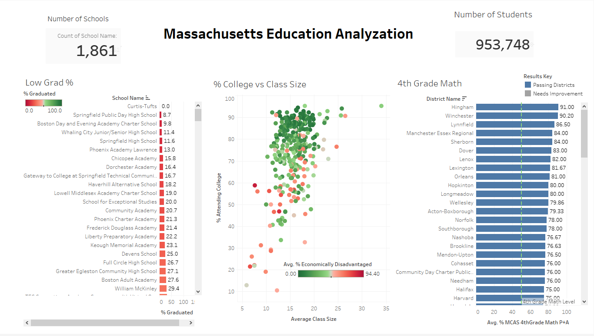

# Welcome to My Portfolio

---

### Learn About My Projects

#### [DoorDash Marketing Analysis](https://www.linkedin.com/pulse/doordashs-marketing-results-breakdown-christopher-wetzel/)

Here, I used **excel** to analyze and **deliver valuable business insights** to the stakeholders of iFood. (the Brazilian DoorDash)

---
#### [Massachusetts Education Report](https://www.linkedin.com/pulse/massachusetts-education-deep-dive-christopher-wetzel/?trackingId=PlVmTKQ%2FSLKhKcbelXN%2Big%3D%3D)

For this project, I created a **[dashboard using Tableau](https://public.tableau.com/app/profile/chris.w2754/viz/Mass_EducatationAnalyzation/Dashboard1)** to analyze the education within the state of Massachusetts. Many specific questions of the Superintendent were discovered and answered.

---

#### [Analysis of World Bank using PostgreSQL](/sample_project)

For this project, I used **PostgreSQL** to analyze the total transactions, amount due, and the single country who has both the most transactions and amount due to the World Bank.

---

#### [Healthcare Analysis using MySQL](https://www.linkedin.com/pulse/healthcare-analysis-using-mysql-christopher-wetzel/?trackingId=7QkR6lPyR8ehRa16l5jCkg%3D%3D)
<imgsrc="hospital-photo.PNG"/>
For this project, I used **MySQL** to to write queries and analyze the hospital's pateint data to provide valuable insights to the hospital.

---

### My Projects - Quick Links

- [DoorDash Marketing Analysis - Excel](https://www.linkedin.com/pulse/doordashs-marketing-results-breakdown-christopher-wetzel/)
- [Massachusetts Education Report - Tableau](https://www.linkedin.com/pulse/massachusetts-education-deep-dive-christopher-wetzel/?trackingId=PlVmTKQ%2FSLKhKcbelXN%2Big%3D%3D)
- [Analysis of World Bank - PostgreSQL](https://www.linkedin.com/pulse/analysis-world-bank-using-postgresql-christopher-wetzel/?trackingId=HeBv3XyaRFKCH4QnMYgfZg%3D%3D)
- [Healthcare Analysis - MySQL](https://www.linkedin.com/pulse/healthcare-analysis-using-mysql-christopher-wetzel/?trackingId=7QkR6lPyR8ehRa16l5jCkg%3D%3D)

---

